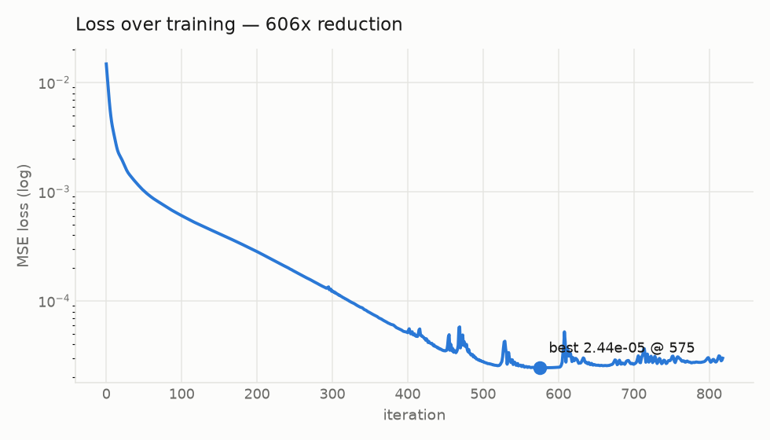

# Differentiable Rasterizer

A 2D triangle rasterizer that runs backwards. Give it a target image and it
gradient-descends the scene — vertex positions, colors, opacities — until the
render matches.


The trick that makes this possible is *soft* rasterization: a pixel's coverage
by a triangle is `sigmoid(signed_distance / sigma)` rather than a hard in/out
test. A hard test has zero gradient everywhere and an undefined one exactly at
the edge, so an optimizer never learns which way to move a vertex. Softening the
silhouette gives every pixel near an edge a real derivative.

| Target (176px) | 150 triangles, fitted, exported at 1024px |
| --- | --- |
|  |  |



Loss falls **606x** in about 17 seconds on a single core. The fit runs at 176px
and the result exports at 1024px without refitting, because geometry is stored
in normalized coordinates rather than pixels.

## What's here

| Language | Share | Job |
| --- | --- | --- |
| **Rust** | ~72% | Rasterizer, analytic gradients, Adam, CLI |
| **TypeScript** | ~14% | Browser viewer — watch a fit converge live |
| **Python** | ~14% | Experiment driver, charts, GIF assembly |

Each language is doing something the others would do worse. Rust owns the inner
loop, where per-pixel work over hundreds of iterations decides whether this is
interactive or not. Python owns experiments and presentation, where matplotlib
and Pillow already exist and rewriting them would be pointless. TypeScript owns
the viewer, because a browser is the only place someone can drop in their own
photo and watch the optimizer work without installing anything.

```
crates/diffrast/        Rust core
  src/raster.rs         Soft coverage, signed distance, forward render
  src/grad.rs           Reverse-mode gradients + finite-difference reference
  src/optim.rs          Adam with per-parameter learning rates
  src/fit.rs            Fitting loop, sigma annealing, steppable Fitter
  src/canvas.rs         f32 RGB buffer, MSE loss, PNG + sRGB conversion
  src/scene.rs          Triangle/Scene types, flat parameter view
  src/serial.rs         Scene JSON export
  src/bin/{fit,render}  Command-line tools
crates/diffrast-wasm/   WebAssembly bindings
python/diffrast/        Runner, plots, GIF assembly
web/                    TypeScript viewer
```

## Running it

**Command line.** Fit an image and write every artifact:

```sh
cargo run --release --bin fit -- photo.jpg --tris 200 --iters 2000 --save-every 10
```

| Flag | Default | Meaning |
| --- | --- | --- |
| `--tris` | 128 | triangles in the scene |
| `--iters` | 1500 | optimizer steps |
| `--size` | 192 | longest side of the fit |
| `--out` | `out` | output directory |
| `--save-every` | 0 (off) | write a frame every N iterations |
| `--export` | 1024 | longest side of the final render |
| `--seed` | 0 | RNG seed |
| `--patience` | 250 | stop after N stalled iterations (0 disables) |

Omit the image to fit a generated synthetic target. Outputs are `fit.png`,
`target.png`, `scene.json`, and `loss.csv`.

**Python** — the same fit plus charts and an animated GIF:

```sh
pip install -r python/requirements.txt
python python/report.py photo.jpg --tris 200 --iters 2000
python python/sweep.py --counts 32 128 512      # compare triangle budgets
```

**Browser** — a live fit you can point at your own image:

```sh
cd web && npm install && npm run all && npm run serve
# open http://localhost:8080
```

## How it works

### The forward pass

Coverage is `sigmoid(sd / sigma)`, where `sd` is the signed distance to the
triangle boundary — positive inside. Distance is measured to the nearest edge
*segment*, not to the nearest edge's infinite half-plane. Half-planes are
cheaper but badly overestimate distance near corners, which would give wrong
gradient magnitudes exactly where triangles meet.

Triangles composite back-to-front with alpha-over. Rendering happens in linear
light; gamma is applied only when writing a PNG.

### The backward pass

`render_with_tape` records what the reverse sweep needs; `backward` returns the
loss and one gradient per parameter — 6 position, 3 color, 1 alpha per triangle.

```rust
let (rendered, tape) = render_with_tape(&scene, params);
let (loss, grads) = backward(&scene, params, &tape, &rendered, &target);
```

Compositing is sequential, so the reverse sweep needs the canvas as it stood
*before* each triangle was painted. Storing a full canvas per triangle costs
`K × W × H × 3` floats — 630MB for 200 triangles at 512px. "Un-compositing" by
dividing by `1 - w` avoids that but blows up as `w` approaches 1. So the tape
saves only the rectangle each triangle actually touched, and memory scales with
coverage instead.

The one derivation worth reading the comments for is the distance term. For the
nearest edge `(a, b)`, closest point `a + t(b - a)`, and unit vector `u` from
that point toward the pixel:

```
d(dist)/da = -(1 - t) * u        d(dist)/db = -t * u
```

That holds whether the projection lands inside the segment or is clamped to an
endpoint — in the interior case `t` sits at a minimum of the distance, so the
term through `dt` vanishes. Carrying a spurious `dt` term is the standard way
this gradient ends up subtly wrong near corners, and it fails quietly: nothing
crashes, fits just converge worse than they should.

`finite_difference` computes the same gradient numerically. It is far too slow
to train with; it exists so the analytic path can be checked against it, which
`cargo test` does over all 10 parameters of a two-triangle scene.

### Making it converge

Three things matter more than the rest.

**Sigma annealing.** The fit starts blurry (`sigma_start = 0.02`, roughly 4px)
and sharpens geometrically to `sigma_end`. Starting sharp is the most common way
a fit stalls — with a tight sigma, a triangle that doesn't already overlap the
region it should cover sees no gradient at all and never moves. The schedule is
geometric rather than linear because sigma is a scale: halving it means the same
thing at 0.02 as at 0.002, so equal ratios deserve equal time.

**Per-parameter learning rates.** Positions live in normalized units where the
whole canvas is 1.0 wide, so they need a much smaller rate than colors. A single
global rate either freezes geometry or flings vertices off-screen.

**Color initialization from the target.** Each triangle is seeded with the
target's color at its centroid, so the fit starts near the right palette and
spends its steps on geometry instead of rediscovering that the sky is blue.

Alpha is projected into `[1e-3, 0.999]` rather than `[0, 1]`, because the
backward pass gives a clamped alpha no gradient — a triangle that reached
exactly 0 could never come back.

## Robustness

- **Invalid configs are rejected up front** with a specific error. A zero sigma
  divides by zero deep inside the coverage function and a negative learning rate
  quietly *maximizes* the loss; both are far harder to diagnose after the fact.
- **The best scene is returned, not the last.** Annealing means late iterations
  can be marginally worse than the middle of the run.
- **Divergence is caught.** A non-finite loss stops the fit before NaN can enter
  Adam's moments, where it would never leave.
- **Non-finite parameters are sanitized** each step. NaN survives `clamp` — it
  propagates through both comparisons — so it is replaced outright.
- **Early stopping** on a configurable patience, so a converged fit doesn't burn
  its remaining budget.
- **Non-square and 1-pixel targets** are handled without cropping.
- **Both CLIs report errors and exit non-zero** rather than panicking.
- **The serializer can't emit invalid JSON** — `NaN` and `inf` are not JSON, and
  a serializer that can produce unparseable output is a trap.

## Tests

```sh
cargo test --release          # 61 Rust tests
python -m unittest discover -s python -p "test_*.py"   # 31 Python tests
cargo clippy --all-targets    # clean
cargo fmt --all -- --check
```

The tests worth knowing about: `analytic_gradient_matches_finite_differences`
checks every parameter against a numerical gradient; `gradient_points_downhill`
verifies a step along the negative gradient actually reduces the loss;
`stepping_matches_the_batch_loop` pins the browser's incremental path to the
CLI's batch path so they cannot drift apart.

One honest limitation: the finite-difference check runs at `sigma = 0.03`, much
softer than a finished fit. At production sharpness the sigmoid saturates and
central differences measure numerical noise rather than the derivative. That is
a limitation of the *check*, not the gradient — but it means the analytic path
can't be validated directly at the sigma a fit ends on.

## License

MIT — see [LICENSE](LICENSE).
