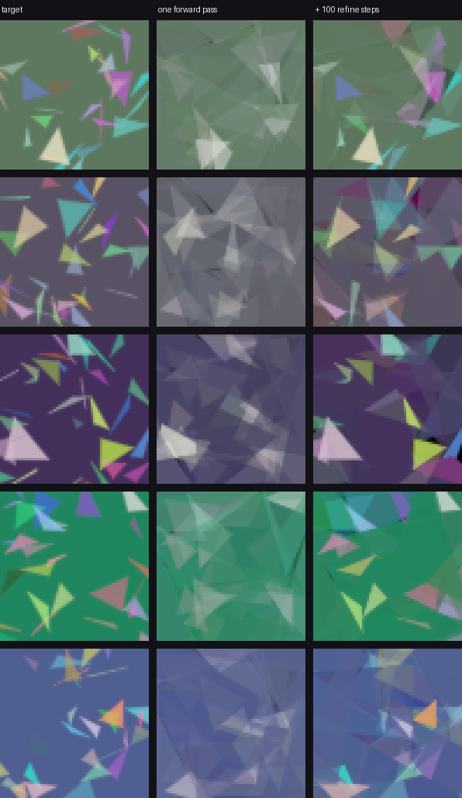

<div align="center">

# Differentiable Rasterizer

[](crates/)
[](python/)
[](web/)

[](docs/GPU.md)
[](python/diffrast/torch_layer.py)
[](web/)
[](#tests)
[](.github/workflows/ci.yml)
[](.github/workflows/ci.yml)
[](#license)

**A 2D triangle rasterizer that runs backwards.**

Give it a target image and it gradient-descends the scene — vertex positions,
colors, opacities — until the render matches. Then it learns to skip the
descent entirely.


</div>

---

## In 30 seconds

A renderer turns geometry into pixels. This one also runs the other way: it
turns pixels back into geometry, by making the render **differentiable**.

The trick is *soft* rasterization. A pixel's coverage by a triangle is
`sigmoid(signed_distance / sigma)` rather than a hard in/out test. A hard test
has zero gradient everywhere and an undefined one exactly at the edge, so an
optimizer never learns which way to move a vertex. Softening the silhouette
gives every pixel near an edge a real derivative.

That buys two things, and the second is the interesting one:

|  | what it does | where |
| --- | --- | --- |
| **Fit** | descend 150 triangles onto one image, ~17 s single-core | `crates/diffrast` |
| **Learn** | train a CNN to *predict* the scene in one forward pass | `python/` |

| Target (176px) | 150 triangles, fitted, exported at 1024px |
| --- | --- |
|  |  |

Loss falls **606x**. The fit runs at 176px and exports at 1024px without
refitting, because geometry is stored in normalized coordinates, not pixels.

---

## Amortized inverse graphics

Fitting one image takes hundreds of gradient steps. A network trained *through*
the renderer predicts a whole scene in a single forward pass — and the fitter
starts from there instead of from noise.



<sub>Middle column: no optimization at all, just one forward pass. Right column:
the fitter, started from it. Generated by `python/figure.py`.</sub>

```python
from diffrast.torch_layer import rasterize

params = model(image)                     # (B, T, 10)
render = rasterize(params, 128, 128)      # (B, 3, H, W)
loss = F.mse_loss(render, image)
loss.backward()                           # gradients reach the model weights
```

**One forward pass is worth ~40 fitting iterations.** Measured on held-out
data, not asserted.

---

## Results

Everything below is measured, reproducible from this repo, and reported with
the failures included.

### The GPU backend wins every cell of the crossover

Batched forward+backward, RTX 4090 vs a 26-core i9-13900, GPU speedup:

|  | 32 triangles | 128 triangles | 512 triangles |
| --- | --- | --- | --- |
| **64x64** | 1.85x | 1.70x | 2.26x |
| **128x128** | 4.06x | 4.96x | 3.89x |
| **256x256** | 3.64x | **6.03x** | 3.89x |

It did not start there. It started **losing** most of those cells, and the
reason was not what the profile said — twice. Atomic contention on the gradient
accumulators was the real bottleneck; fixing it cut dispatch at 256px from
**73.4 ms to 1.95 ms**, then buffer pooling and a device-side loss reduction
removed **8.9x** of what remained.

→ **[docs/GPU.md](docs/GPU.md)** — the full investigation, including both wrong
diagnoses and the barrier-uniformity hazard that made the fix hard.

### The model learned a real mapping — on real photographs

|  | synthetic scenes | STL-10 photos |
| --- | --- | --- |
| input gain | 8.29 dB | **9.20 dB** |
| margin over baseline | 4.56 dB | **5.88 dB** |
| mirror response | 0.90 | 0.59 |

**A falling training loss is not evidence that any of this works.** A network
that ignored its input and emitted one generic scene would still drive that
loss down. So `evaluate.py` scores every prediction against *somebody else's*
target, and against a flat per-image colour fill that requires no training at
all.

The first honest measurement had the model **losing to the flat colour fill**.

→ **[docs/AMORTIZED.md](docs/AMORTIZED.md)** — what was actually wrong, the
confounded experiment that blamed the wrong thing first, and the scaling study
that followed.

### What scaling actually buys

At identical compute — 9.6M samples, 150,000 steps, only reuse frequency varies:

| unique scenes | margin | verdict |
| --- | --- | --- |
| 40k | 3.48 dB | |
| 160k | 4.43 dB | **the knee** |
| 640k | 4.56 dB | +0.13 dB for 4x the data |

Data beats compute roughly 2:1. Model width is worth **+0.24 dB for 2x the
parameters** — capacity was never the constraint.

---

## Quick start

```sh
# Fit an image
cargo run --release --bin fit -- photo.png --tris 150 --iters 800

# Benchmarks, including the GPU crossover
cargo bench
cargo run --release --bin gpu_bench

# Train the predictor
cd crates/diffrast-py && maturin develop --release && cd ../..
python python/train.py --synthetic --epochs 60 --raster-device auto
python python/evaluate.py --checkpoint runs/amortized/best.pt --synthetic --refine-steps 100
```

### The browser viewer

```sh
cd web && npm install && npm run all && npm run serve   # localhost:8080
```

Verified 2026-08-11 driving a real headless Chrome over the DevTools protocol —
not just compiled. WebAssembly loaded, Start clicked, iteration 32 → 76 and loss
2.55e-3 → 1.90e-3 over six seconds, zero console errors.
`stepping_matches_the_batch_loop` pins the viewer's per-frame path to the CLI's
batch loop so they cannot drift apart silently.

---

## Why three languages

Each one is doing something the others would do worse.

```
crates/diffrast/        Rust core — the inner loop decides if this is interactive
  src/raster.rs         Soft coverage, signed distance, forward render
  src/grad.rs           Reverse-mode gradients, patch tape, FD reference
  src/optim.rs          Adam with per-parameter learning rates
  src/fit.rs            Fitting loop, sigma annealing, steppable Fitter
crates/diffrast-gpu/    WGSL compute shaders via wgpu
crates/diffrast-py/     PyO3 — the rasterizer as a torch autograd op
crates/diffrast-wasm/   WebAssembly bindings
python/                 Torch layer, model, training, evaluation, sweeps
web/                    TypeScript viewer — drop in a photo, watch it converge
```

**Rust** owns the per-pixel work over hundreds of iterations. **Python** owns
training and presentation, where PyTorch and matplotlib already exist.
**TypeScript** owns the viewer, because a browser is the only place someone can
try this without installing anything.

The rasterizer's own backend is chosen with `--raster-device`, independent of
the torch device. `auto` reads a measured crossover and **branches on whether
the GPU is discrete** — on an integrated part the CPU wins every size tested, a
2-3x difference in the opposite direction, which no single threshold describes.

---

## Tests

```sh
cargo test --release                                   # 86 Rust
python -m unittest discover -s python -p "test_*.py"   # 65 Python
cargo clippy --all-targets && cargo fmt --all -- --check
```

The ones that matter:

- **`analytic_gradient_matches_finite_differences`** — every parameter against a
  numerical gradient. Checked again from the PyTorch side so the binding layer
  cannot quietly corrupt a gradient in transit: agreement within **0.34%**,
  cosine similarity 0.9992.
- **`test_input_gain_is_zero_for_a_model_that_ignores_its_input`** — builds a
  deliberately input-blind model and asserts the evaluation controls catch it.
  *An instrument that cannot fail on a known-bad input is not evidence about a
  good one.*
- **`test_pooling_to_one_discards_spatial_layout`** — asserts the architectural
  defect directly on the pooling layer, so it is a property of the operation
  rather than a story about one training run.
- **`buffers_are_reused_across_identical_calls`** — a repeated GPU call must
  allocate *nothing*. A pool that silently never hit would be invisible in a
  timing.
- **`stepping_matches_the_batch_loop`** — the browser's incremental path against
  the CLI's batch path.

**On validating a gradient numerically.** Finite-difference error is U-shaped in
the step size, and a step off that curve's floor produces a convincing-looking
failure that is entirely an artifact:

| step | 1e-4 | **5e-4** | 1e-3 | 5e-3 | 1e-2 |
| --- | --- | --- | --- | --- | --- |
| relative error | 1.49% | **0.34%** | 0.54% | 10.2% | 20.0% |

Below the floor, float32 cancellation dominates. Above it, the step measures
curvature rather than slope. The tests use 5e-4.

---

## What is not solved

Kept here deliberately — a project that reports only its wins is not reporting.

- **Resolution transfer fails.** A model trained at 128px scores +4.44 dB at
  128px and **−1.17 dB at 96px**, from the same weights. Training across
  resolutions (`--sizes`) narrows the gap and does not close it.
- **Mirror response drops to 0.59 on photographs** from 0.90 on synthetic
  scenes. The model leans harder on colour statistics than on spatial layout for
  real images, and whether that is the pooled head's known layout-blindness or a
  genuinely different strategy is undiagnosed.
- **Tiled binning** is the only remaining GPU lever, and only because everything
  around dispatch got cheaper — it is now 61% of a backward call, up from 15%.

Further reading: **[docs/GPU.md](docs/GPU.md)** ·
**[docs/AMORTIZED.md](docs/AMORTIZED.md)** ·
**[docs/RUNBOOK.md](docs/RUNBOOK.md)** · **[docs/SESSION.md](docs/SESSION.md)**

## License

MIT.
